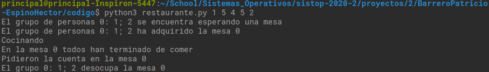

# Identificación y Descripción del Problema

Describan la situación que moldearán:

>Trabajando en un restaurante donde los comensales al llegar se someterán a un proceso donde se les otorgará una mesa acorde a la espera en una cola.
>
>Los meseros deben recoger los platos de distintas mesas. Tomando cada uno un área para sí. Cada mesero atenderá a las nuevas mesas. Los meseros recogen los platos de un área de salida.
>
>Los chefs reciben en el área de salida la orden a hacer (en una cola) y estos la preparan. La preparación será a través de un FiFo.

¿Dónde pueden verse las consecuencias nocivas de la concurrencia? ¿Qué eventos pueden ocurrir que queramos controlar?:
>Existen distintas instancias donde se tuvo que serializar una accipon  debido a que en caso contrario tendríamos condiciones de carrera e inanición. Ejemplo de esto es en la clase cocina, de no contar con las protecciones necesarias, causaríamos que un proceso busque extraer de una lista vacía. Levantando efectivamente una excepción.

¿Hay eventos concurrentes para los cuales el ordenamiento relativo no resulta importante?
>No hay ninguno, todos en cierto modo requieren de conocer el orden en que llegaron los procesos.
>Aunque en algunos no será unicamente acorde a esto que se trabajará.

Descripcion de los mecanismos de sincronización empleados:
> Se utilizan semáforos, mutex, barrearas y combinaciones de alto nivel de estos.
>
>Ej: Se utiliza un señalador junto con un semaforo para mostrar el caso de haber ordenes en la barra.
>De este modo el servicio puede trabajar con la barra mientras que los chefs esperan la siguiente orden.

Identificación del estado compartido:
> Existen estructuras que serán de uso compartido. Mesas, Barra, además de acciones dentro de la manipulación de esas areas.
>
> Cabe aclarar que hubo distintas situaciones de concurrencia por más pequeñas que estas se vean. Adems de estructuras complejas que se dedican al manejo de la concurrencia de grandes estructuras.

Descripción algoritmica del avance de cada hilo/proceso.

>**Cliente:**
>
>1. Espera mesa
>2. Toma la mesa
>3. Dice lo que quiere comer y que sea rápido
>4. Come
>5. Pagar
>
>**Mesero:**
>
>1. Toma orden
>2. Recibe la orden
>3. Sirve la comida
>4. Lleva la cuenta
>5. Recoge la mesa
>
>**Chef:**
>
>1. Recoge la orden
>2. Cocina
>3. Deja la comida en la barra de entregas.
>
>Se instancias lan clases de alto nivel Cocina, comenzales y meseros.
>Todos los anteriores serán hilos que trabajaran en los estados mencionados anteriormente.
>
> Cocina:
>Se crea una barra que permite interactuar entre servicio y chefs.
>Viaja entre los distintos estados y permite que cada uno de estos avance de forma independiente.
>Recibe ordenes, las cocina y devuelve
>
>Servicio:
>Estructura de alto nivel que controla el trabajo de los meseros.Permitiendo viajen entre sus distintos estados y evitando condiciones de carrera al interactuar con los clientes.
>Ejemplo de estas condiciones al asignar una mesa a un cliente y el como se dosificarán estas.

Descripción de la interacción entre ellos:
> Para el caso de barrera, es de este modo que mientras los cocineros esperan al mutex de disponibles, servicio puede obtener el mutex de la lista y añadir nuevas ordenes, evitando así condiciones de carrera.
>

¿Qué lenguaje emplean? ¿Qué version?
>Python3 >= 3.7
¿Qué bibliotecas más allá de las estándar del lenguaje? 
>Ninguna

Bajo que sistema operativo/distribución lo desarrollaron y lo probaron?
>Debian Buster, Elementary os

Pantallasos:

