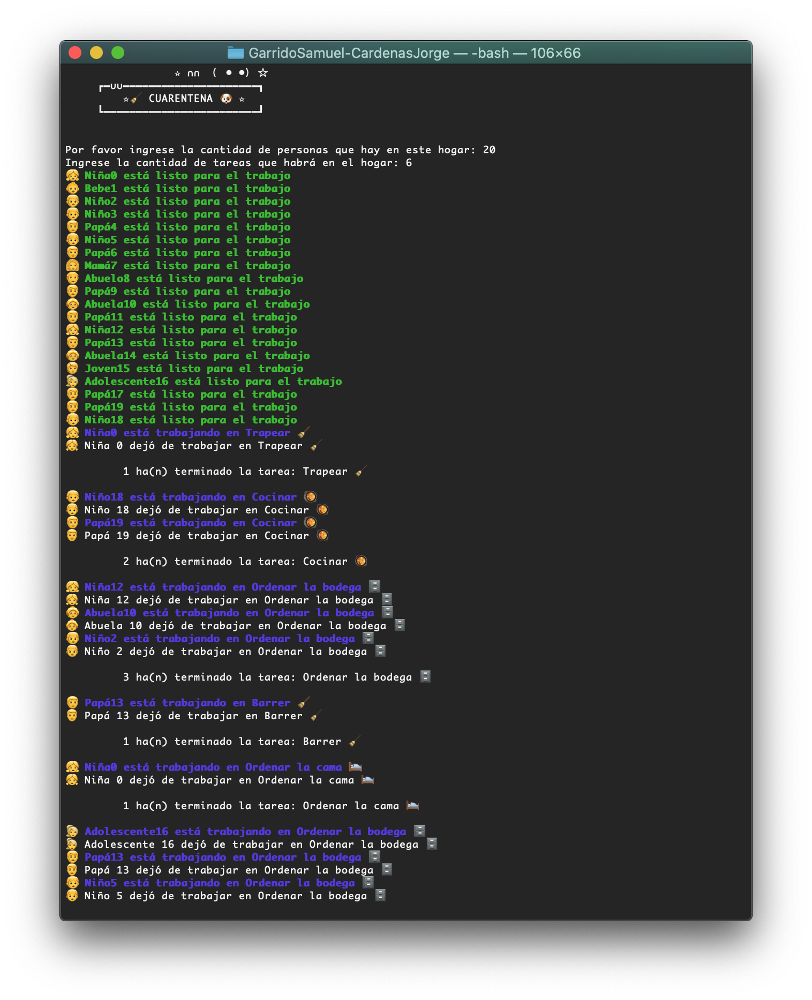
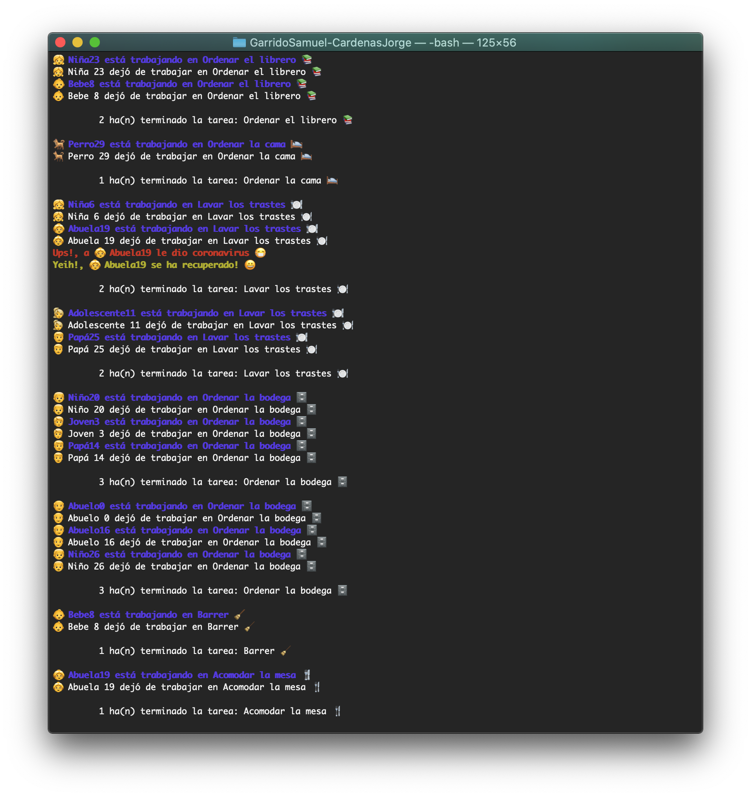
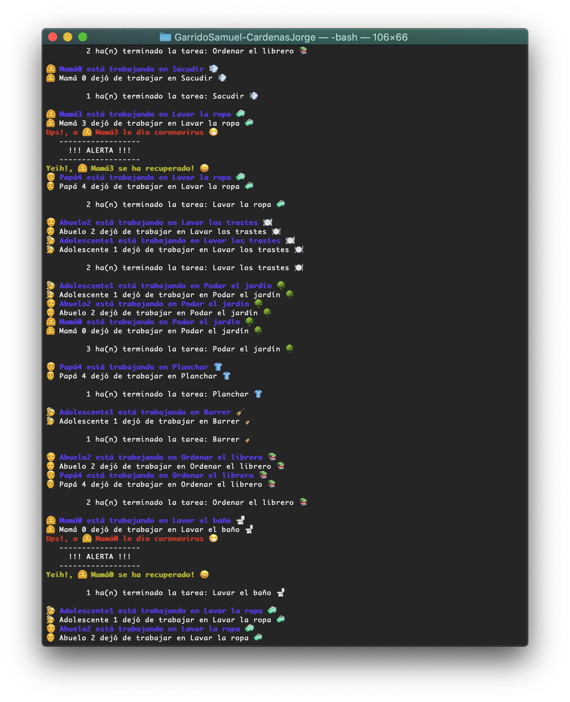

# 🧹 🧻 🧽 Cuarentena 🦠 🏠 😷

Durante estos días de cuarentena se nos ha ocurrido hacer una simulación acerca de las tareas domésticas que tiene uno que hacer y las acciones que siguen la mayoría de nosotros. Así pues las reglas de negocio son las siguientes:

## Reglas de los quehaceres. 🤯

Érase una vez, en "amor en tiempos de COVID-19", donde estaban todos en sus respectivas casas, aburridos por cierto, esperando el milagro de que se ordene sola. Lamentablemente la vida es cruel y se dan cuenta que para que haya ropa limpia en el ropero o haya platos limpios en la repisa debe haber trabajo de por medio. 

Algunas familias cuentan con 2, 3, o hasta 10 integrantes en una sola vivienda, no importa. Todos deben realizar labores del hogar y no existen restricciones para que un integrante se limite a no hacer alguna tarea, así puede ser que "el niño arregle el lavabo y el papá ordene los juguetes".

Todos deben contribuir al quehacer, y a las 8 de la mañana todos deben estar presentes para iniciar el quehacer (que nunca acaba por cierto 😢) y se realizan entre una o más personas. Cuando una persona termina su tarea puede ir a descarsar un rato a su hamaca y volverá a trabajar cuando le llamen para otra tarea.


Si a una persona le da COVID todo se detiene y hasta que se recupere van a seguir las actividades. 

## Propuesta de solución 🤔

Para la lista de tareas se propone un torniquete ya que no se puede realizar varias tareas a la vez, éstas se irán distribuyendo una vez que sea terminada una tarea. 

Se implementan **2 barreras**: una para identificar que todos los integrantes estén listos para empezar la limpieza y otra para que hasta que todos los integrantes que estén involucrados en la tarea.

Por otra parte existe un mutex en caso que un familiar tenga COVID y tendrá un tiempo de 0.5 para recuperarse, hasta entonces se detiene la realización de tareas en la lista de espera.

## Implementación 🤩
Se desarrolló un archivo proyecto2.py que incluye estos aspectos importantes:

### Patrones de sincronización

**Primera Barrera** 🧱

Hasta que que todos los integrantes de la casa estén listos para empezar

```python
mutexFamiliar.acquire()
cuentaListos = cuentaListos + 1
print_pass(str(self.parentesco)+str(self.numero)+' está listo para el trabajo')
familiarDisponible.append(self)
if cuentaListos == cantidad_personas:
	barreraListos.release()
```

**Segunda Barrera** 🧱

Hasta que todos los elementos dentro de la los familiares solicitados estén ya en la lista de disponibles, signfica que todos los involucrados terminaron de realizar la tarea y se fueron a descansar a la lista de disponibles.

```python
while True:
	if all(elem in familiarDisponible for elem in requeridos):
		print('\n\t',requeridosParalaTarea,'ha(n) terminado la tarea:',nombreTarea,'\n')
		self.barrera.release()
		self.barrera.acquire()
		self.barrera.release()
		break

```
**Torniquete** 
Para el torniquete las personas en la familia se van a una lista y se mandan a llamar de uno por uno para realizar una tarea. Puede que 2 hagan la misma tarea.

```python
mutexFamiliar.acquire()
requeridos.append(familiarDisponible.pop(random.randrange(len(familiarDisponible))))
mutexFamiliar.release()
mutexFamiliar.acquire()
mutexFamiliar.release()
for i in requeridos:
	i.Trabajar(nombreTarea)
```
**Torniquete**
El torniquete de tareas nos permite pasar una tarea de uno en uno para su realización por miembros de la familia, (*no estoy muy seguro de éste*)

```python
mutexTarea.acquire()          
listaDeTareas.append(threading.Thread(target = Tarea, args= [y, requeridosParalaTarea,nombreTarea]).start())
mutexTarea.release()
mutexTarea.acquire()
mutexTarea.release()
```

### Agregados 👀
Se cuenta con una función banner que realiza un texto con "==" para dar introducción, también con funciones de impresión en pantalla especiales que permiten tener colores gracias a la biblioteca **sys**. 

## Ejecución 🖥
Para la ejecución debe emplearse el comando:

```python
~:$ python3 proyecto2.py
```
Se proporcionará el número de tareas y el número de personas y hasta ese entonces comenzará la ejecución.

#### Ejemplos:



