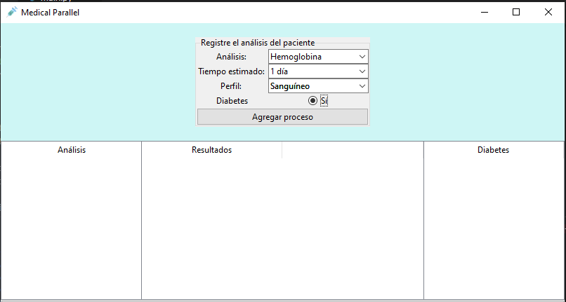
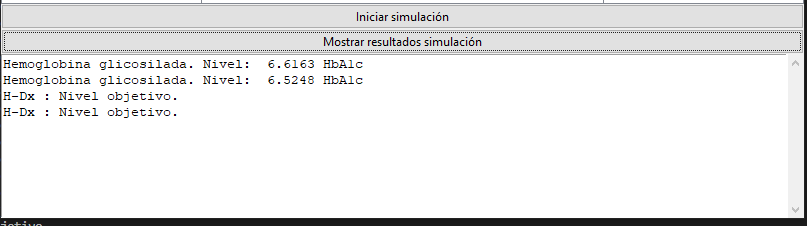
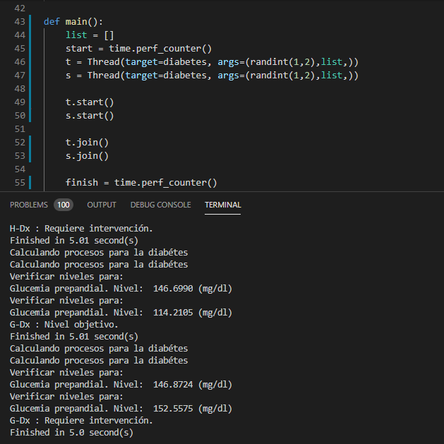

## Proyecto 2. Paralelización del mundo real.

# Situación:
Paralelizar varios procesos, dónde cada uno simula un "análisis" clínico que se le
debe realizar a un paciente. Este sistema de inicio pide algunas cosas como:

	- Nombre del análisis.
	- Tiempo estimado que se tardaría.
	- Perfil (Conjunto de técnicas a utilizar).

# Archivos importantes:

- main : Es donde van los procesos paralelizados. Cuenta con tres métodos.
	- main : donde se ejecutan los hilos.
	- diabetes : donde se definen los procesos que se requierían para un diabético.
	- otros_padecimiento : donde se agregarían padecimientos para generar perfiles.

- gui.project : es donde se define bajo el paradigma POO los métodos necesarios para
generar la interfaz gráfica del usuario.

# Ejecución:

Se trabajo con la librería tkinter, la cual se supone se instala junto con las instlación normal de Python. Tiene las funciones básicas para realizar implementaciones sencillas. Para ejecutar el programa se puede hacer de varias formas, las que me funcionaron desde mi computadora fueron:

	$ python3 gui_project.pyw

	$ gui_project.pyw

O simplemenete presionando la aplicación con el mouse ubicado el archivo con extensión
".pyw", pues representa el archivo ejecutable de la aplicación en Python.

## Notas:

# - Sobre la complicaciones técnicas de la interfaz.

Antes de esta interfaz había utilizado alguas librerías de otro lenguaje como javafx, swing, entre otras además del desarrollo web. En realidad mi mayor impedimento para lograr un mejor proyecto fue que no conocía bien las herramientas, pero igual me aventuré.

# - Sobre la funcionalidad del proyecto.

Actualmente el prototipo no esta del todo bien, hubo módulos de la aplicación que no pude efectuar adecuadamente debido a que no conocía a la perfección la herramienta tkinter. Sin embargo se dejo el maquetado y se procede a dar una explicación de lo que se buscaba.

# La parte de ingreso de datos.

En esta parte se pretende que el médico ingrese varios procesos para un paciente y que se pongan a ejecutar todos al mismo tiempo, con las características que pide de inicio como los perfiles y el nombre del estudio. Todas estás opciones de dan disponible en una lista
desplegable:

 
 

#La parte donde se siulan los procesos.

En esta parte se pretende que se pudieran ver todos los procesos que se van agregando, para que posteriormente se creen instancias inclusive de pacientes y tengamos paralelismo de procesos por cada usuario. Bueno en desarrollos más a futuro:

 
 

## Pruebas:

Las primeras pruebas del programa se hicieron en la terminal como es costumbre,
por lo que se incluyen algunas imagenes de como funcionaría este módulo:

 
 

# Conclusiones.

No se alcanzaron los objetivos como se esperaban, aunque la situación era interesante. La implementación fue un tanto más complicada por el desconocimiento de las herrmientas que me propuse a utlizar.
