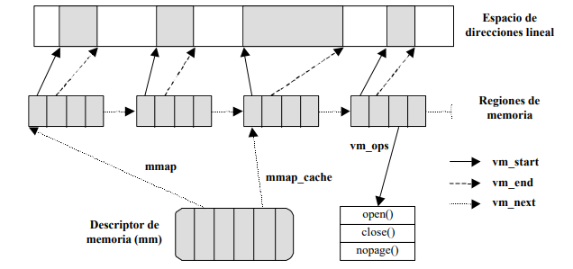
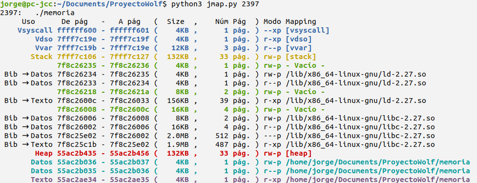
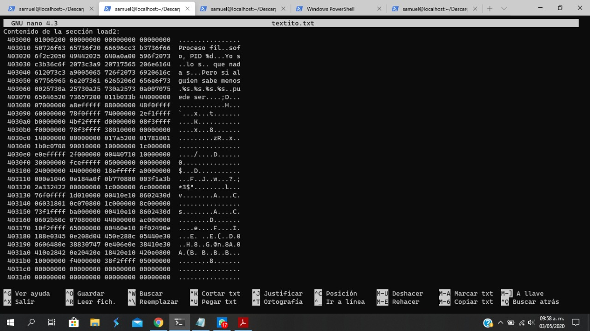
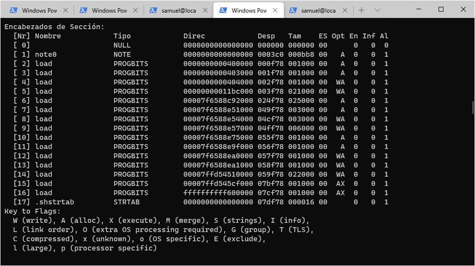
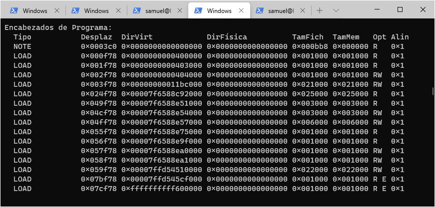
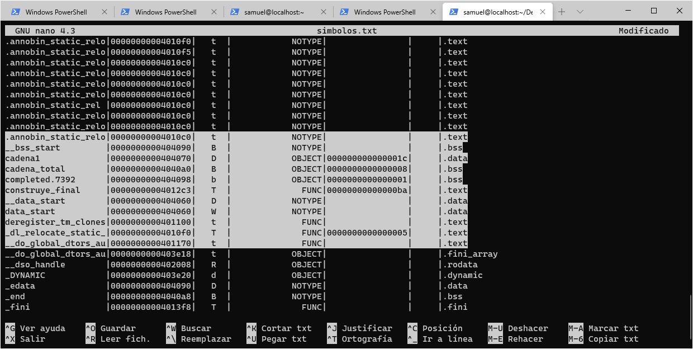
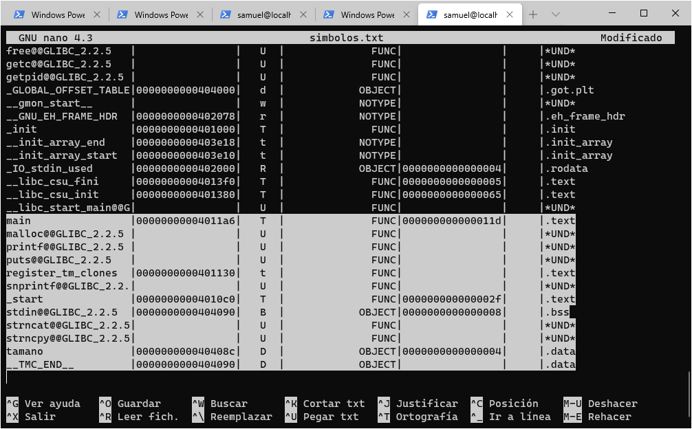
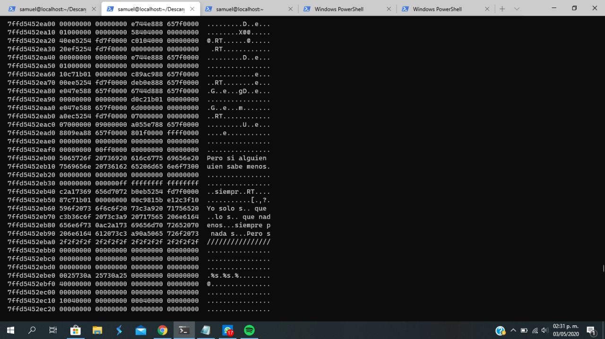
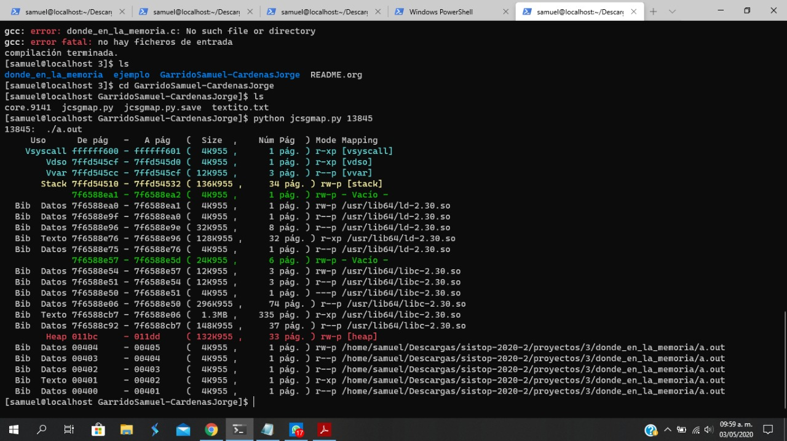
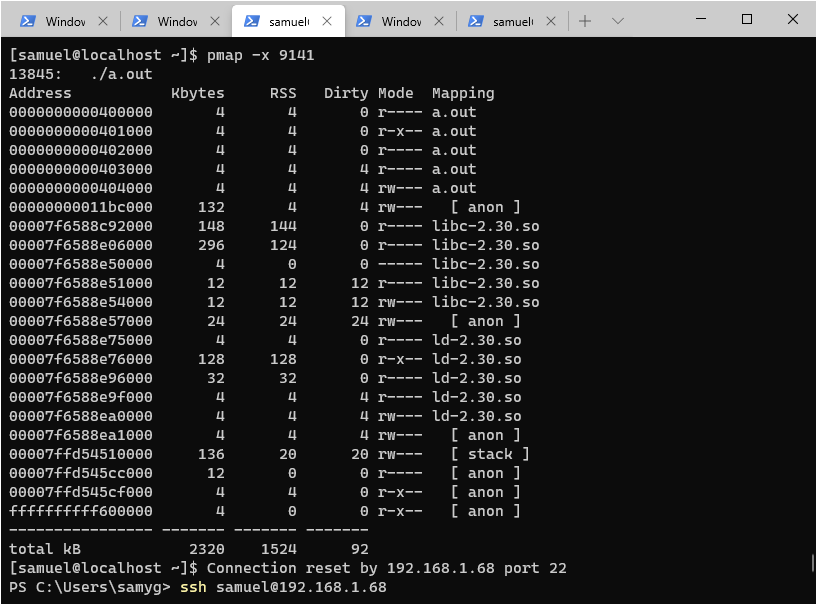

# Asignación de memoria en un sistema real 💻

#### Autores: ✒️ 
- Cárdenas Cárdenas, Jorge
- Garrido Sánchez, Samuel Arturo

## Introducción 🍔

Cuando utilizamos nuestra computadora o cualquier dispositivo que posea un sistema operativo comercial orientado a usuarios masivos no vemos lo que pasa por detrás y algunos llegan a confundir el concepto de memoria con la persistencia de datos en una unidad. La memoria principal es uno de los recursos más valiosos que gestiona el sistema operativo; está separada lógicamente de tal manera que todos los procesos se consideran únicos dentro del sistema excepto los hilos que comparten la mayor parte de memoria que tiene asignada. La memoria se categoriza por memoria virtual y memoria física, que mediante una unidad llamada MMU pueden gestionar de mejor manera la memoria, a través del método de paginación.

## Marco teórico 🍦

El sistema de gestión de memoria en un sistema operativo es el que se encarga de asignar mediante algún método, que por lo regular es paginación*, el espacio que debe de ocupar un proceso en memoria física. Este internamente debe de garantizar los siguientes objetivos 

**Objetivos del sistema de gestión de memoria** 🧀

- Proporcionar protección entre procesos
- Permitir que los procesos compartan memoria
- Ofrecer a cada proceso un espacio lógico propio
- Maximizar el rendimiento del sistema
- Dar soporte a las distintas regiones del proceso

###### Tipo de direcciones de un proceso 🍞

Son los espacios de direcciones relacionados en la gestión de memoria. 

-  Direcciones físicas: Referencian alguna posición de la memoria física. Se obtiene después de aplicar una transformación del MMU.
- Direcciones lógicas: Utilizada por los procesos. El MMU le realizan transformaciones antes de convertirlas a direcciones físicas.
- Direcciones lineales: Se obtienen a partir de las direcciones lógicas tras aplicarles una transformación dependiente de la arquitectura. Lógicas y lineales en Linux no son idénticas. 32 bits se pueden utilizar para direccionar 4GB de direcciones físicas de memoria. Las direcciones lineales se representan normalmente en hexadecimal y va de rango 0x00000000 a 0xffffffff
  - En i386 es el nombre que reciben las direcciones tras aplicar segmentación, se le suma la dirección lógica una dirección base, esto da como resultado la dirección lineal.
  - A partir del kernel 2.2 de Linux las direcciones base casi de todos los segmentos es 0. Por tanto las **direcciones lineales y las lógicas son las mismas**.

La MMU es parte del procesador y tiene como funciones:

- Comprobar los permisos que un proceso tiene para acceder a una cierta dirección de memoria
- Convertir las direcciones lógicas a físicas
- Comprobar que la conversión se pueda realizar. 

La MMU se inicializa para cada proceso del sistema y permite que cada proceso pueda usar el rango completo de direcciones lógicas.

#### Paginación 🌮

El espacio virtual de direcciones se divide en espacios del mismo tamaño llamadas páginas.  La memoria principal se divide en page frames del mismo tamaño que la páginas virtuales y son compartidas por los procesos del sistema. La tabla de páginas relaciona cada página con el marco que la contiene y el MMU utiliza la tabla de páginas para traducir de direcciones lógicas a físicas.

Existe también el TLB que es un buffer caché con información sobre las últimas páginas accedidas.

### Regiones de memoria 🍕

El SO GNU/Linux organiza los intervalos de memoria utilizados por un proceso llamado regiones de memoria. Estos tienen la característica que cada uno se encuentra compuesto por una dirección lógica inicial, una longitud y permisos de acceso. Aquí la implementación es llevada a cabo por medio de objetos de tipo `vm_area_struct` que es el descriptor de área de memoria virtual. Cada descriptor identifica un rango o intervalo de direcciones lineales.



Para acelerar las búsquedas las búsquedas los descriptores utilizan una estructura de tipo árbol AVL con lo que reducen la complejidad de la búsqueda de O(n) a O(log2 n). A partir de la versión 2.4.9 de Linux se utiliza árboles roji-negros para acelerar las búsquedas de un descriptor en una región particular.

## Implementación 🥞

### Ejercicio 1 🍟

Para la primera parte del proyecto se ha desarrollado una reimplementación básica del comando 'pmap' a partir de la información que Linux nos muestra de sus procesos en ejecución ('/proc/pid/maps' y '/proc/pid/cmdline').

jsmap muestra la informacion sobre cual es el uso, el rango de direcciones de las paginas asociadas, el tamaño de segemento, el número de páginas, los permisos o privilegios asociados, y el mapping o mapeo a donde hace referencia cada segmento de memoria asociado a un proceso.

Es necesario recordar que todo fichero ejecutable consta de una cabecera y una serie de secciones que permiten construir los segmentos de la imagen de memoria de un proceso.

En sistemas con memoria virtual, las diferentes regiones que integran el proceso suelen estar separadas y tienen un tamaño definido por un número entero de páginas.

Las regiones más relevantes de la imagen de memoria de un proceso son:

    - Código
    - Datos
    - Pila.

Una región que contiene activos los permisos de lectura y ejecución 'r-x' y que además su contenido se obtiene del propio fichero ejecutable, correspone una la región de texto del programa.

Una región que contiene activos los permisos de lectura y escritura 'rw-' y que además su contenido se obtiene del propio fichero ejecutable, correspone a la región de datos del programa.

#### Ejemplos

| Permisos | Biblioteca | Usos |
| -------- | ---------- | ---- |
| 'r-x' | /home/... | Segmento de Texto |
| 'r-x' | /lib/... | Biblioteca de Texto |
| 'rw-' | /home/... | Segmento de Datos |
| 'rw-' | /lib/... | Biblioteca de Datos |

#### Ejecución

Para ejecutar el programa se debe emplear el siguiente comando:

~~~
python3 jsmap.py PID [PID]
~~~

Donde:

-**PID:** hace referencia al identificador o ID de un proceso.

Es posible obtner el mapeo de 'n' cantidad de procesos.

#### Ejemplo 🖥



#### Requerimientos del sistema 🛠️
Fue desarrollado utilizando el lenguaje de programación Python con las sigueintes características:

```
Python 3.6.9 (default, Nov  7 2019, 10:44:02) 
[GCC 8.3.0] on linux
```

Por lo que se recomienda ejecutarse en un Python 3 en algún entorno GNU/Linux o tipo UNIX.

### Ejercicio 2 🥪

Para visualizar estos ejercicios se utilizaron los siguientes comandos, archivos y directorios:

```shell
~$cat /proc/{PID}/maps     #Mostramos elementos que ejecuta ese proceso y la región de memoria ocupada
~$nm -f sysv donde_en_la_memoria #Muestra la tabla de símbolos a través de nm(sirve para depuración de ficheros binarios como bibliotecas, módulos objeto y ejecutables)
~$readelf -Wa core.PID # No realizará una descripción similar donde tendremos los módulos LOAD que dentro se encontrarán los elementos que buscamos de símbolos, variables y funciones.
~$gcore -a PID ## Obtenemos el volcado del proceso en memoria en un core.PID
~$objdump -x core.PID ## Muestra el contenido de todos los headers. Esto nos permite identificar los LOADs y en cuál se encuentran nuestras variables, los bss (no inicializados) y funciones.
~$objdump -s core.PID ## Muestra todo el contenido den la sección. Se nos muestra todo el mapeo de la memoria con la ubiación exacta de cada palabra o variable que tengamos en memoria. 
~$pmap -x PID #reporta el mapa de la memoria de un o unos procesos
```

Ahora para comprobar que realmente en la memoria se acomoda el proceso de la manera ilustrada en nuestro ejercicio 1, tenemos que hacer un volcado del proceso lanzado cuando lo hacemos con gcore

Primero seguimos estos pasos, dentro de la carpeta donde_en_la_memoria

```shell
~$ cd proyectos/3/donde_en_la_memoria
~$ ./donde_en_la_memoria
~$ gcore -a PID ## Genera el archivo.core
```

Una vez generado el core podemos analizarlo con objdump para analizar las secciones con las que contará. 

````shell
~$ objdum -x core.PID ## Genera el archivo.core
````

El comando anterior nos dirá la arquitectura en que fue construido junto con el formato del core y los encabezados. Nos marca precisamente lo que decíamos en la teoría que la dirección de inicio es 0x0000000000000000. Contamos con una arquitectura tipo i386: x86-64.


Si queremos una visualización entera de la memoria y donde exactamente se ubican los strings que colocó el profesor: "Yo solo sé que no se nada" y otros, podemos 

```shell
~$ objdum -s core.PID ## Muestra todo el contenido de la memoria por dirección
```



Notamos que los strings se encuentran en direcciones pequeñas y altas de memoria y por el ejercicio anterior pmap nos dice que las secciones marcadas o como ./programita son en realidad donde se encuentran las variables y de esto podemos decir:

- La zona de memoria estática es para datos que no cambian de tamaño, permite almacenar variables globales que son persistentes en la ejecución del programa
- En el heap podemos encontrar las variables adquiridas dinámicamente via calloc o malloc
- En el stack encontraremos argumentos y variables locales en la función que está definida.

Además las bibliotecas que cuentan con direcciones altas (77xxxxxx. en nuestro caso) encontraremos también a los strings ya que aquí se manda ya que aquí se encuentra el printf. Por esa razón es que en el diagrama generado por pmap -s encontraremos en varias cargas load los strings colocados en el programa donde_en_la_memoria.c

##### Comando readelf 🥡

Si queremos obtener más información podemos obtenerla con el comando readdelf -Wa core.PID donde obtendremos el mágico, número de headers, tamaño de los headers, número de secciones de headers y más adelante igual nos ofrece las direcciones de memoria física y virtual de las cargas.


Módulos LOADs, y dónde se irán



Dirección física, virtual, desplazamiento, tamaño fichero, tamaño memoria.



En esas cargas encontraremos las variables, strings y funciones dentro del programa donde_en_la_memoria.c

**Analizando el ejecutable** 🍩

Ahora otra manera de ubicar los elementos usando otro comando de Linux nm. Para utilizar el cuso **nm** necesitamos el ejecutable donde_en_la_memoria

```shell
~$ nm -f sysv donde_en_la_memoria
```

Aquí encontraremos los elementos que cuenta el ejecutable y la dirección y tenemos las variables y funciones **cadena1, cadena_total,construye_final** que nos marca la dirección de memoria. Vemos como decíamos que tiene las regiones con una dirección chica en memoria como 4060. 



Incluso podemos denotar la diferencia entre variable asignada y no asignada con .data ya que cadena 1 al tener un texto nos indica que es de tipo .data y cadena_total al no estar inicializada es marcada como .bss que es usado este nombre por varios compiladores y linkers para indicar la parte de un archivo de objeto o ejecutable que contiene variables asignadas estáticamente y que no se inicializan explícitamente a ningún valor. 

**Aquí podemos encontrar símbolos que no forman parte de mi código fuente pero que son parte de las bibliotecas o archivos auxiliares para que mi programa de c pueda funcionar. Por ejemplo__data_start para inicializar los valores _DYMAMIC para gestinar la memoria dinámica y más adelante _start,snprintf, _init y las correspondientes a los headers o .h que se involucren en nuestro programa para que pueda ser ejecutado.**

Luego más adelante encontraremos a las funciones de las bibliotecas o que no definimos nosotros sino el compilador. La main como principal que en nuestro caso tiene la dirección 4011a6 y de tipo .text.



De igual manera encontraremos las funciones printf. Analizando nuestro diagrama de abajo encontraremos que las cadenas entregadas a printf se encontrarán en secciones de memoria muy elevadas como 7777xxxxx. como denotamos a continuación y esa es la diferencia con las que se encuentran definidas como .data en la región de memoria estática que tiene direcciones bajas. 



Por último comparamos con nuestra ejecución de nuestro programa de python y vemos justamente que los datos que están marcados en la región de memoria estática, como ~/a.out (porque lo compilamos otra vez). Y se encuentran en las direcciones de memoria bajas. como 00405. Estos son nuestras variables con .data, y la función construye_final y lo que siga del heap serán las variables globales o funciones globales para que nuestro programa donde_en_la_memoria pueda correr. El stack marcado al final de la memoria se utilizará a la ejecución para las funciones definidas por nuestro programa.

```shell
~$ python3 jsmap.py PID
```



Finalmente comprobamos nuestra hipótesis con el comando pmap y justamente a.out en memoria estática = variables y funciones dadas en el programa. Luego en heap se encuentran bibliotecas de apoyo. 

```shell
~$ pmap -x PID
```




## Conclusión 🍪

La gestión de memoria es un elemento crucial dentro de nuestro ordenador, de hecho es tan importante como la administración de procesos. Se ha pasado por varias técnicas desde asignación continua de memoria, pasando por segmentación y terminando con paginación siendo la última la más utilizada y recomendada en la gestión de memoria en los sistemas actuales. Hemos comprobado que cada proceso se cree único dentro de la memoria y vemos que los elementos que contenga el código fuente se irán a diferentes secciones como la región de memoria estática, el heap y el stack dependiendo el tipo de variable o función que tengamos. En linux toda la información del sistema se maneja como archivos así que dentro del directorio `/proc/PID/` encontraremos toda la información sobres este proceso y cómo utiliza la memoria virtual. De ahí extraemos la información que mostramos en nuestro PMAP personalizado y además corroboramos mediante un volcado de nuestro proceso y analizamos mediante algún debugger o en nuestro caso `objdump` la forma en que realmente se distribuye mediante la interpretación del hexadecimal del proceso. Y justamente se cumple hasta analizando completamente la memoria con `objdump -s core.PID` (por si queda alguna duda y para ver la diferencia entre el string de variable y el que se le entrega a printf)

Además se ubicó de manera precisa cada uno de los elementos mediante el comando `nm -f sysvv ejecutable` y así encontramos cada elemento en nuestro proceso, como los .data, .bss, .text que son variables, funciones y variables sin inicializar. De 


## Bibliografía ☕

Tomás Arredondo Vidal. (2010). Memoria, Stacks, Strings. 05 de Mayo del 2020, de UNIVERSIDAD TECNICA FEDERICO SANTA MARIA Sitio web: http://profesores.elo.utfsm.cl/~tarredondo/info/datos-algoritmos/ELO-320-Memoria.pdf

HIMANSHU. (2012). 10 Practical Linux nm Command. 06 de Mayo del 2020, de The Geek Stuff Sitio web: https://www.thegeekstuff.com/2012/03/linux-nm-command/

SANFOUNDRY. (2015). 10+ “objdump” Command Usage Examples in Linux. 03 de Mayo del 2020, de SANFOUNDRY Sitio web: https://www.sanfoundry.com/objdump-command-usage-examples-in-linux/

Universidad de Almería. (2014). Gestión de Memoria. 05 de Mayo del 2020, de Departamentos de Lenguajes y computación. Universidad de Almería. Sitio web: https://w3.ual.es/~acorral/DSO/Tema_3.pdf

Federico Kereki. (2008). Discover the possibilities of the /proc directory. 04 de Mayo del 2020, de The Linux Foundation Sitio web: https://www.linux.com/news/discover-possibilities-proc-directory/