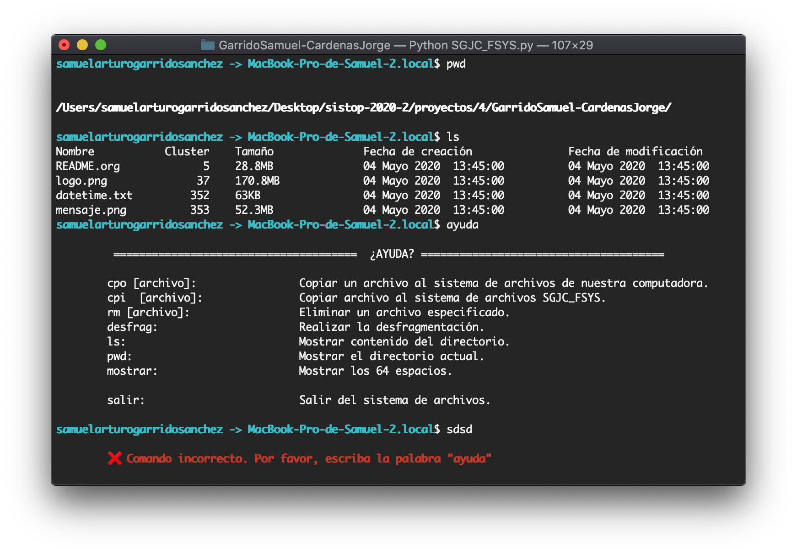
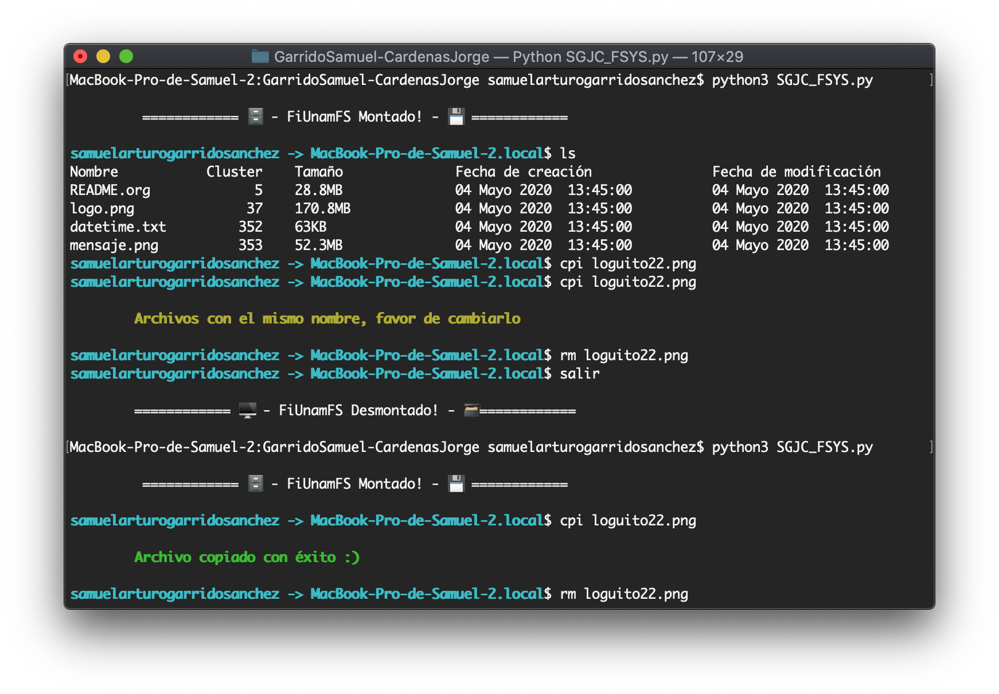
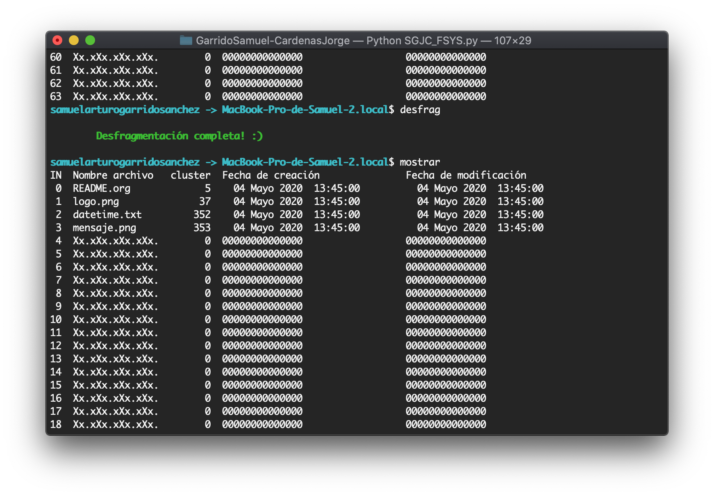
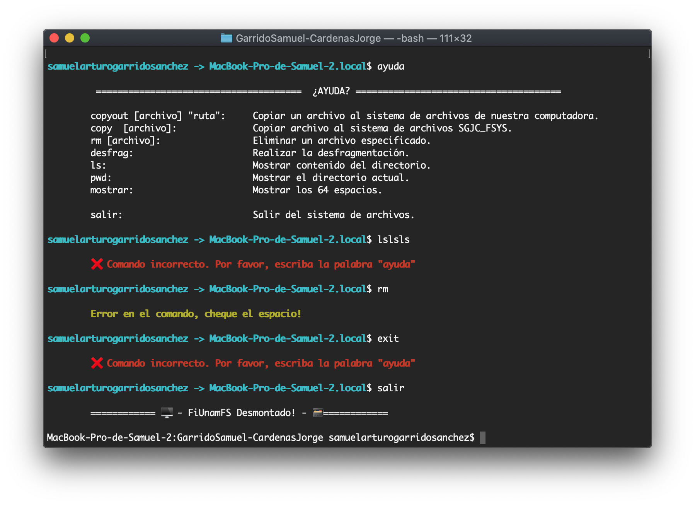

# Creación de un mini sistema de archivos 💻

#### Autores: ✒️ 
- Garrido Sánchez, Samuel Arturo
- Cárdenas Cárdenas, Jorge

## Introducción 🍔

Un sistema de archivos es un subsistema del S.O. encargado de la gestión de la memoria secundaria (concretamente del almacenamiento de la información en dispositivos de memoria secundaria).
Se encuentra en los niveles más externos del sistema operativo (más próximos al usuario). 

Este nivel suministra al usuario el concepto de archivo (una de las abstracciones fundamentales que genera un sistema operativo).

El sistema de archivos es el subsistema que suministra los medios para la organización y el acceso a los datos almacenados en dispositivos de memoria secundaria (disco).


## Marco teórico 🍦

El medio sobre el que se almacenan los archivos se divide en bloques de longitud fija, siendo el sistema de archivos el encargado de asignar un número adecuado de bloques a cada archivo.

**Funciones del sistemas de archivos:** 🧀

- Crear y borrar archivos.
- Permitir el acceso a los archivos para que sean leídos o escritos.
- Automatizarlagestióndelamemoriasecundaria.
- Permitir referenciar un archivo por su nombre simbólico.
- Proteger los archivos frente a fallos del sistema.
- Permitir el uso compartido de archivos a usuarios autorizados

### Apertura de un archivo
Al abrir un archivo, el sistema de archivos debe tomar el nombre del archivo suministrado y localizar sus bloques de disco. En sistemas tipo UNIX, se lee el nodo-i de ese archivo y se guarda en memoria central hasta que se cierra el archivo

Las búsquedas de nombres relativos se realizan de forma similar, sólo que partiendo del directorio actual en lugar del directorio raíz.

### Integridad del sistema de archivos
La destrucción de una computadora puede resultar desastrosa por el coste que conlleva, aunque sería fácilmente reemplazable.

Sin embargo, la destrucción de un sistema de archivos suele tener consecuencias catastróficas puesto que la restauración de la información puede resultar difícil, consumir mucho tiempo o, sencillamente, ser imposible.

### Desfragmentación
La desfragmentación es el proceso conveniente mediante el cual se acomodan los archivos en un disco para que no se aprecien fragmentos de cada uno de ellos, de tal manera que quede contiguo el archivo y sin espacios dentro del mismo.

## Implementación 🥞
Se realizó un sistema de archivos para poder abrir la imagen: `fiunamfs.img`. Se desarrolló un prompt personalizado y manejo de todos los casos posible con mesajes característicos. Las acciones que se pueden realizar en nuestro sistema son:

- Copiar un archivo desde fiunamfs.img hacia nuestro sistema de archivos
- Copiar un archivo desde nuestros archivos hacia fiunamfs.img
- Desgragmentar fiunamfs.img
- Listar los elementos dentro de fiunamfs.img mostrando los clústers y el tamaño de los archivos.
- Remover un archivo de fiunamfs.img
- Mostrar el mapa del sistema de archivos donde podemos ver los espacio llenos o vacíos de los 64 tamaños de entrada
- Mostrar el directorio actual, una ayuda y salida controlada del programa.

Para lograr esto se realiza una simulación de un arreglo de inodos donde cada vez que se encuentre la expresión Xx.xXx.xXx.xXx. será el comienzo de otro archivo. Mediante el registro de los apuntadores a estos archivos podremos manipularlos mejor.

Para gestionar muchos problemas se implementa una función de búsqueda que permite buscar coincidencias ya sea para la función de remover o de copiar desde y hacia fiunamfs.img y con ello nos libramos de problemas como:

- No se encuentra el archivo
- Nombres duplicados

Para el caso de eliminar, cuando encontramos la coincidencia, toda la cadena o el segmento que comprenda el archivo dentro de fiunamfs.img será reemplazado por ceros. 

Para copiar hacia mi directorio comienzo por cumplir las condiciones que nombres menores a 15 caracteres, archivo no más grande que lo que soporte fiunamfs.img. Luego ordenamos los inodos, luego el archivo que voy a copiar tenemos que partirlo en base al tamaño de los clusters y después vamos insertando los elementos bloque pedazo por pedazo. En el caso de copiar hacia afuera, mediante la función si matcheamos algún elemento tenemos donde comienza y donde termina, por lo que mandamos la imagen dada una cierta región seleccionada.

Para finalizar la desfragmentación es realizada con un movimiento, donde la vamos recorriendo todo lo que esté marcado como vacío y a la vez todo lo que se encontraba lleno se colocará en si todavía no llegamos a llenar consecutivamente esa área de memoria.

#### Ejecución

Para ejecutar el programa se debe emplear el siguiente comando:

```shell
$ python3 SGJC_FSYS.py
```

Al ejecutarse se contará con un prompt personalizado donde podremos colocar los siguientes comandos


#### Comandos
| Comando | Descripción |
| -------- | ---------- |
| pwd | Mostramos el directorio en el que nos encontramos | 
| ls | Mostramos el contenido del directorio dentro del sistema de archivos |
| rm [archivo] | Elimina un archivo especificado dentro de la imagen |
| mostrar | Muestra los espacios dentro del sistema de archivos |
| cpi [archivo]| Copiar un archivo al sistema de archivos |
| cpo [archivo]| Copiar un archiv al sistema de archivos de nuestra computadora |
| desfrag | Desframgenta o quita los espacios vacíos en el sistema después de removerlos |
| salir | Sale de nuestro programa |
| ayuda | Muestra estos comandos en terminal para guiar al usuario | 

Cabe destacar que se agregó como opción la interrupción a teclado mediante CONTROL + D, CONTROL + C o CONTROL + Z.

**SI UN COMANDO NO ESTÁ DENTRO DE LOS ESPECIFICADOS, MARCARÁ ERROR**


### Ejemplos de ejecución 🖥


##### Ayuda, mostrar los archivos y error de comando

##### Montaje, mostrar archivos, copiar hacia fiunamfs.img, remover y voler a intentar con éxito

##### Memoria fragmentada después de remover un elemento, copiar hacia afuera de fiunamfs.img


##### Desfragmentación y comprobación


##### Posibles errores y salida del programa


#### Requerimientos del sistema 🛠️
Fue desarrollado utilizando el lenguaje de programación Python con las siguientes características:

```
Python 3.6.9 (default, Nov  7 2019, 10:44:02) 
[GCC 8.3.0] on linux
```


## Conclusión 🍪
Los sistemas de archivos son escenciales para la persistencia de datos y ya que no estamos en los años 70 como para cargar todo nuestro programa en memoria cada rato, tendremos que hacer uso de algún sistema de archivos para almacenar nuestros ficheros. Existen de todos sabores y colores y depende en gran medida del sistema operativo. Podemos usar implementaciones como VFat para ilustrarnos, más en la realidad para implementar hasta directorios se vuelve más complejo al grado que sistemas de archivos como HDFS+ utiliza árboles B. GNU LINUX admite la administración de manera transparente al usuario de más de 15 tipos diferentes de sistemas de archivos, incluyendo NTFS (Microsoft Windows), iso9660, msdos y vfat. La estructura de archivos es una estructura jerárquica en forma de árbol invertido, donde el directorio principal (raíz) es el directorio "/", del que cuelga toda la estructura del sistema.


## Bibliografía ☕


HIMANSHU. (2012). 10 Practical Linux nm Command. 25 de Mayo del 2020, de The Geek Stuff Sitio web: https://www.thegeekstuff.com/2012/03/linux-nm-command/

Lars Wirzenius. (2013). Utilizando Discos y Otros Medios de Almacenamiento. 26 de Mayo del 2020, de Guía Para Administradores de Sistemas GNU/Linux Sitio web: http://www.tldp.org/pub/Linux/docs/ldp-archived/system-admin-guide/translations/es/html/ch06s08.html