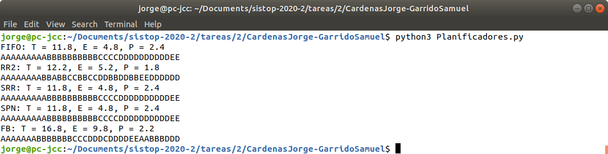

# Planificadores de Procesos 📈️

### Alumnos: 
- Cárdenas Cárdenas Jorge
- Garrido Sánchez Samuel Arturo

## Introducción 🍎

En este proyecto se han desarrollado los algortimos de planificacion de procesos:

- FCFS (first come, first serve)
- RR (Round Robin)
- SRR (Selfish round robin)
- SPN (Shortest process next)
- FB (multilevel feedback)

con un número de procesos dados por el usuario, y un tiempo de ejecucion aleatorio para cada proceso; esto con el fin de realizar una comparacion entre el **tiempo de Espera**, **Tiempo de Respuesta** y la **Proporcion de penalización** entre cada planificador.

## Ejecución 
Para ejecutar el programa se debe emplear el siguiente comando:


~~~
python3 Planificadores.py [<num_procesos>] [<num_quantums>] [<num_colas>]
~~~

Donde:

-**num_procesos:** es el primer argumento que se recibe, es el número de procesos a simular, por defecto el programa asigan 5 
-**num_quantums:** es el segundo argumento que se recibe,y son el número de quantums que considerará el planificador RR, por defecto 2 
-**num_cola:** es el tercer argumento y corresponde con el número de colas de prioridad para el planificador FB

## Ejemplo 🖥



## Requerimientos del sistema 🧩
Fue desarrollado utilizando el lenguaje de programación Python con las sigueintes características:

```
Python 3.6.9 (default, Nov  7 2019, 10:44:02) 
[GCC 8.3.0] on linux
```

Por lo que se recomienda ejecutarse en un Python 3 en algún entorno GNU/Linux o tipo UNIX.