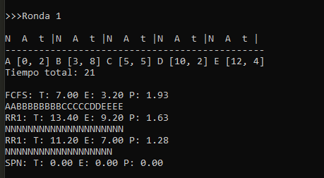

<<<<<<< HEAD
## Ejercicios de algoritmos de planificación

# Algoritmos resultos:
- FCFS. Cuenta con su propio algoritmo que va calculando la información deseada.
- RR1. En este caso, se partió de un algortimo que se pudiera ampliar al variar q.
- RR4. Se realizó a parti de RR4, con la variación del parámetro q.

# Métodos utilizados:
- init_arrives() : Genera los tiempos de llegada de cada proceso de
	de manera aleatoria para un número n de procesos.

- generator_time() : Genera los tiempos que requiere cada proceso para
	terminar su ejecución de de manera aleatoria para 
	un número n de procesos.

- time_process() : Genera un diccionario que contiene como llaves el 
	nombre del proceso y como valores una lista con
	los tiempos de llegada y de ejecución.

- divide_list() : Nos ayuda a realizar la división elemento por
	elemento de dos listas.

- average() : Reliza el promedio (media aritmética) de todos
	 los elementos de una lista.

- Además de los algoritmos implementados.

# Ejecución:

Se trabajo en gran medida, como programación estruturada, por lo que no requiere
de procedimientos extra para ser ejecutado. Esta elaborado en python3, por lo que
basta con ejecutar desde terminar de la siguiente manera:

	$ python3 <file_name>

## Notas:

# - Sobre el nombre de los procesos.
	Los nombre de cada proceso son letras mayúsculas, por conveniencia,
	si se quiere agregar más letras se debe de especificar en el main, agregando
	un elemento a la lista de nombres, en orden alfabético.
# - Sobre la representación.
	Aún no logré la modularización más adecuada para poder hacer encajar las
	piezas que me permitieran dejar lista la representación de como se va
	ejecutando cada parte de los procesos (mediante letras) en RR para q=1 y q=4.
# - Sobre los parámetros y variables.
	Hay dos variables en el main que sirven para remplazarse en los parámetros
	de los algoritmos. Uno de ellos es n, que es el número de procesos y el otro
	es m, que es el número de rondas.
# - Sobre los encabezados.
	Son estáticos ya que se pensó en 5 procesos como máximo para esta implmentación,
	así que podrían verse cortos o desfazados si se modifica m y n.

## Pruebas:

	Se incluyen imagen de las prueba de ejecución.

 

=======
# Ejercicio de algoritmos de planificación

Ejercios del curso de sistemas operativos, que nos ayudan a comprobar
el funcionamiento de los algoritmos de planificación, que permiten
asignarle tiempos de espera, proporción de penalización, entre otras
características de de la planificación y sus métricas.

## Los algorimos realizados:

- FCFS. Se realizó mediante su propio algoritmo, recibe dos parámetros
que son el número de rondas y un diccionario de procesos.
- RR1 y RR4. Este algoritmo también recibe un diccionario de procesos
y ún numero de rondas, pero admás recibe el parámetro q que es una
variación de quatum o un rango de ticks.

## Los métodos utilizados:

 _init_arrives() : Genera los tiempos de llegada de cada proceso de
de manera aleatoria para un número n de procesos.
 _generator_time():  Genera los tiempos que requiere cada proceso para
terminar su ejecución de de manera aleatoria para 
un número n de procesos.
 _time_processes(): Genera un diccionario que contiene como llaves el 
nombre del proceso y como valores una lista con
los tiempos de llegada y de ejecución.
 _divide_list() : Nos ayuda a realizar la división elemento por
elemento de dos listas.
 _average() : Calcula el promedio o media aritmética
de los elementos de una lista. 

## La ejecución:

Como se realizó en python y bajo un paradigma que tiende a los estructurado
eso hace que no se tengan que compliar o hacer procedimientos exttra. Sólo
hay que llamar el main mediante la terminal y listo:

		$python3 <nombre_archivo>

# Notas

##  - Sobre los nombres de los procesos.
	
Estos se ingresan mediante una lista en orden, alfabético, por lo que si
se quiere un nombre nuevo se debe agregar en la lista de nombre que está incluida
 en el main, como _names_.

## - Sobre los algoritmos.
	
Se implementaron con algunas deficiencias aún pues no se pudo modularizar del
todo, lo cual no permitió encontrar una maner de simplificar algunos pasos.
Si se le dedica un poco más a cada método, se podría ir sacando detalles que
bien podrían ir en un método a parte o en menos líneas como los ciclos.

## - Sobre la represetación de los procesos.
	
Esa parte si que me faltó mejorarla para la parte de round robi y bueno,
ya ni se diga para el algoritmo de SPN qu ese si de plano ya no me daba
la cabeza para terminarlo.

## - Sobre los encabezados.
	
Se le agregaron algunos detalles estéticos considerando que sólo se trabajaría
con 5 procesos, por ello si se trabaja con más, los encabezados que marcan el
orden para los nombres del proceso y sus tiempos podrían moverse.

## - Sobre parámetros y variables.

Los parametros de cada método considero que son claros. Sin embargo acalro que
los procesos con su nombre y tiempos decidí verlos como un dicionario y eso es
lo que se le pasa a los algoritmos. En el main hay dos variables que son m y n
la primera es el numero de procesos a planificar y la m es el númeor de rondas
para probar el algoritmo.

## Prueba de ejecución.
	
Se incluye una imagen de la prueba de ejecución.

 
 
 
>>>>>>> 3a8d936a01e74e6267e5c2738ec3f30e09349e16
